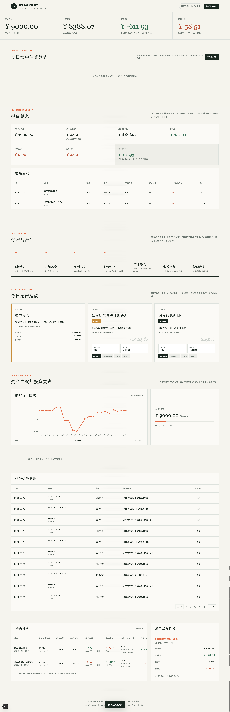
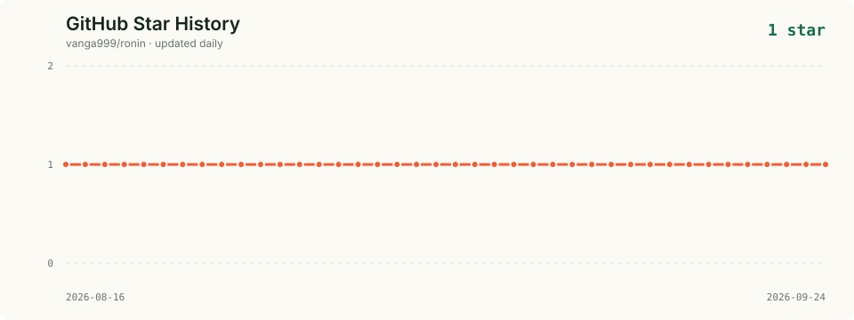
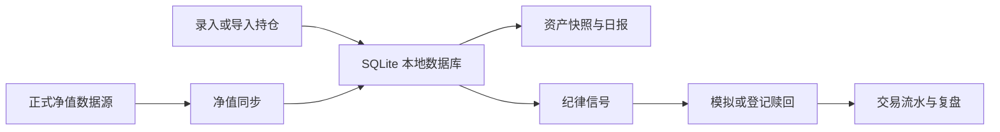

# Fund Intelligence Assistant

基金智能纪律助手是一款面向个人场外基金投资的本地优先（local-first）工具：把持仓、正式净值、交易流水、纪律规则和复盘结果放在同一个 SQLite 数据库里，帮助用户按既定规则观察和执行，而不是凭情绪操作。

> 项目仍处于早期阶段，默认面向个人本地使用。它不提供投资建议，也不保证收益；使用前请先确认数据来源、基金费率和交易结果。

## 界面截图

<p align="center">
  
</p>

## GitHub Star History

<p align="center">
  
</p>

图表由 GitHub Actions 每日更新，数据来自 GitHub Repository API。

## 你可以用它做什么

- 管理账户、基金和每一笔买入批次。
- 从 Excel 或 JSON 一次性导入历史持仓。
- 从天天基金同步历史/最新正式单位净值，并生成每日资产快照和日报。
- 区分“正式净值”和“盘中估算”：估算只用于观察趋势，不进入总账或纪律信号。
- 用可版本化的规则生成允许买入、暂停买入、止盈、风险观察和退出评估信号。
- 按 FIFO（先进先出）记录部分或全部赎回，计算分摊本金、到账金额和已实现收益。
- 在完整退出后生成持有天数、收益、最大回撤和纪律评分复盘。
- 导出/恢复完整 JSON 备份，并为关键变更保留操作日志。

## 界面与数据流



## 快速开始

### 环境要求

- Node.js `22.13+`
- npm
- 能访问天天基金接口的网络环境（仅在同步净值时需要）

### 安装并启动

```bash
git clone <your-repository-url>
cd fund-intelligence-assistant
npm install
cp .env.example .env.local
npm run db:migrate
npm run dev
```

打开 <http://localhost:3000>。

默认数据库路径是 `./data/fund-assistant.db`。如需修改，在 `.env.local` 中设置：

```dotenv
DATABASE_URL=./data/fund-assistant.db
```

建议使用绝对路径或项目目录下的持久化路径。数据库及 WAL 文件已加入 `.gitignore`，不要把个人持仓数据提交到公开仓库。

### 第一次使用

1. 创建一个账户。
2. 手动添加基金，或下载导入模板后批量导入持仓。
3. 点击“刷新正式净值”，检查净值日期和数据来源。
4. 查看资产快照、纪律信号和投资总账。
5. 实际发生赎回后，再登记赎回交易；模拟赎回不会修改数据。
6. 定期下载 JSON 备份，并在需要时从“文件导入”恢复。

## 数据口径与重要限制

- 所有金额、净值、份额和比例在数据库中以字符串保存，服务端使用 `decimal.js` 计算，避免 JavaScript 浮点误差。
- 开放式基金的收益和总账只使用已公布的正式单位净值；正式净值日期可能晚于自然日。
- 盘中估算基于最近披露的前十大持仓与股票行情加权，仅用于观察方向，状态为 `ESTIMATED`。
- 当前默认数据适配器是 `lib/fund-data/eastmoney.ts`，来源标记为 `EASTMONEY`。
- 应用没有登录、权限控制或多租户隔离，不建议直接暴露到公网。
- 删除账户、基金或数据恢复会影响关联数据；操作前请先备份。
- 默认规则只是示例，不代表适合任何人的投资策略。

## 默认纪律规则

规则会保存为策略版本，信号会同时保存触发指标和策略快照，便于之后复盘。默认值如下：

| 条件 | 默认动作 |
| --- | --- |
| 总持仓成本达到 `¥50,000` | 暂停继续投入 |
| 单只基金收益达到 `10%` | 建议赎回 `50%` |
| 单只基金收益达到 `18%` | 建议赎回剩余仓位 |
| 收益达到第一止盈后从峰值回撤 `5%` | 建议退出 |
| 单只基金亏损达到 `-8%` | 暂停继续投入，进入观察 |
| 单只基金亏损达到 `-15%` | 触发退出评估 |

规则不是自动交易指令。用户需要先核对银行/基金平台数据，再手动登记实际交易。

## 文档导航

- [架构与目录](docs/architecture.md)：系统边界、数据流、核心模块和扩展方式。
- [API 参考](docs/api.md)：路由、参数和响应语义。
- [数据导入与备份](docs/data-import.md)：Excel/JSON 格式、事务行为和恢复注意事项。
- [本地开发](docs/development.md)：测试、迁移、构建和提交前检查。
- [贡献指南](CONTRIBUTING.md)：如何提交 issue、修改代码和补充测试。
- [安全说明](SECURITY.md)：本地数据、部署边界和漏洞报告方式。
- [开源发布清单](docs/open-source-checklist.md)：正式公开仓库前需要补齐的项目元数据。

## 开发命令

```bash
npm run dev           # 本地开发服务器
npm run db:migrate    # 创建/升级 SQLite 数据库
npm run db:generate   # 根据 schema 生成 Drizzle migration
npm test              # 运行 Vitest
npm run lint          # ESLint
npm run build         # Next.js 生产构建
npm run start         # 启动生产构建
```

## 技术栈

Next.js App Router · React · TypeScript · SQLite · better-sqlite3 · Drizzle ORM · decimal.js · Zod · Vitest · XLSX

## 许可证

本项目采用 Apache License 2.0，详见仓库根目录的 [`LICENSE`](LICENSE) 文件。
