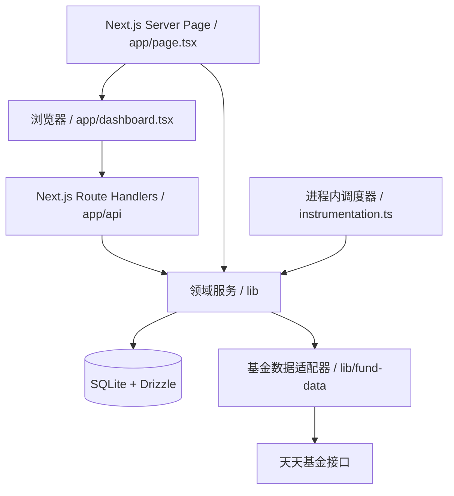
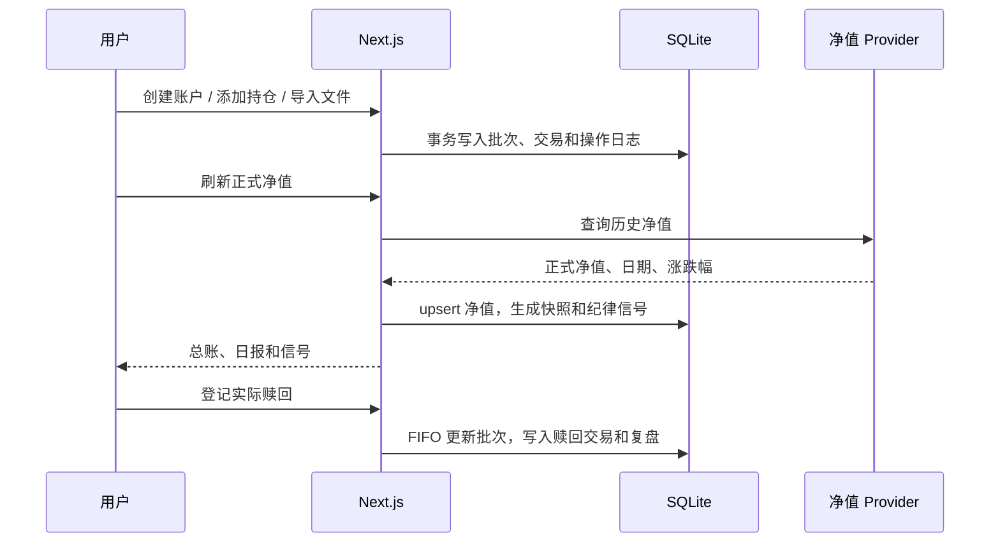

# 架构与目录

## 系统边界

项目是一个单体 Next.js 应用，浏览器负责交互，服务端负责数据库读写、计算和外部净值同步。SQLite 文件是唯一的业务数据存储，适合单用户或低并发的本地部署。

## 目录说明

| 路径 | 职责 |
| --- | --- |
| `app/page.tsx` | 服务端读取首页初始数据 |
| `app/dashboard.tsx` | 单页管理界面和用户操作 |
| `app/api/` | HTTP API Route Handlers |
| `db/schema.ts` | Drizzle SQLite schema |
| `db/index.ts` | 数据库初始化、迁移、事务和 SQLite pragma |
| `drizzle/` | 已提交的数据库迁移 |
| `lib/portfolio-calculation.ts` | 持仓市值、收益和收益率计算 |
| `lib/nav-service.ts` | 正式净值同步、快照和日报 |
| `lib/strategy-engine.ts` | 纯策略判断逻辑 |
| `lib/strategy-service.ts` | 读取策略、生成和保存纪律信号 |
| `lib/redemption-service.ts` | FIFO 赎回分摊和已实现收益 |
| `lib/review-service.ts` | 完整退出后的复盘 |
| `lib/ledger.ts` | 投资总账汇总 |
| `lib/fund-data/` | 外部基金数据 provider 接口和实现 |
| `tests/` | 计算、校验、导入、赎回和数据适配器测试 |

## 核心数据流

## 关键设计约定

### 金融数值

数据库中的金额、份额、净值和比例使用 `TEXT` 保存。输入先经过 Zod 校验，再用 `Decimal` 计算和格式化。新增计算逻辑时不要直接使用 `number` 做金融运算。

### 净值状态

`fund_nav.data_status` 只有 `OFFICIAL` 和 `ESTIMATED` 两种状态。正式净值进入持仓估值、日报和纪律信号；盘中估算单独存放在 `fund_intraday_estimate`，不能混入正式总账。

### 交易与批次

新增买入会同时创建一个 `position_lot` 和一条 `SUBSCRIBE` 交易。赎回按买入日期和创建时间 FIFO 分配到开放批次，并写入 `REDEEM` 交易。已经部分赎回的批次不能直接编辑或删除。

### 审计与事务

涉及业务状态改变的操作应放在事务中，并写入 `operation_log`。批量导入要求整批成功或整批回滚；恢复备份前应先下载当前备份。

### 调度器

`instrumentation.ts` 在 Node.js runtime 注册进程内调度器：每天北京时间 20:00 同步正式净值；交易日盘中按 30 分钟桶生成估算。它不是外部任务队列，部署到多实例或无持久进程环境前需要重新设计调度方案。

## 扩展数据源

实现 `lib/fund-data/types.ts` 中的 `FundDataProvider` 接口，并在 `lib/fund-data/index.ts` 的 `getFundDataProvider()` 中切换实现。provider 至少要保证：

1. 返回真实的 `navDate`，不要把抓取日期冒充净值日期。
2. 正式净值返回 `status: "OFFICIAL"`。
3. 外部字段先校验，再映射为项目内部的字符串数值。
4. 设置超时并保留来源名称，便于排错和数据追溯。
